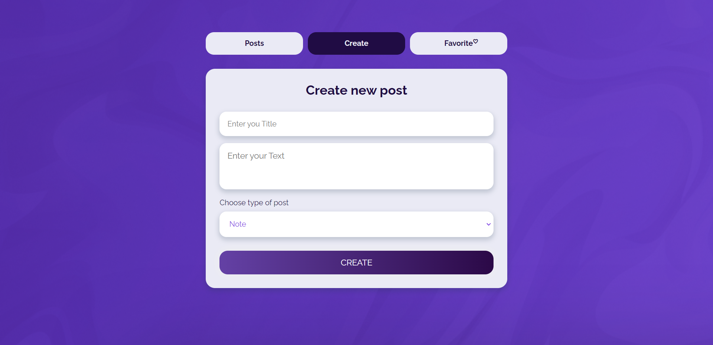
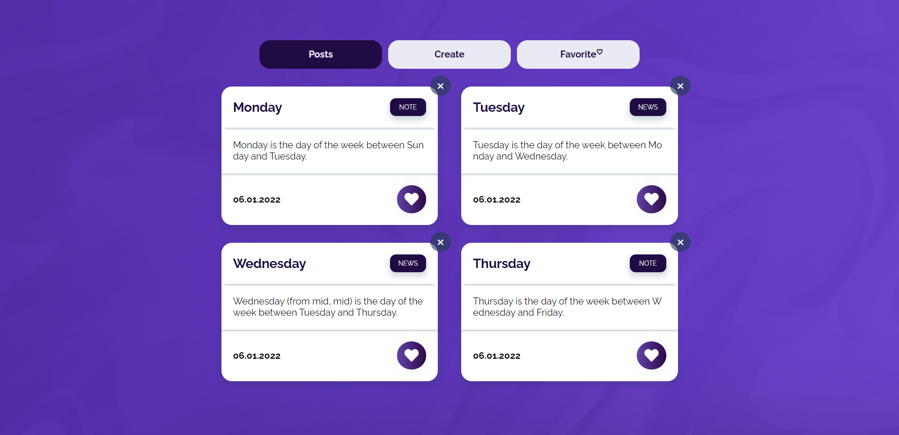
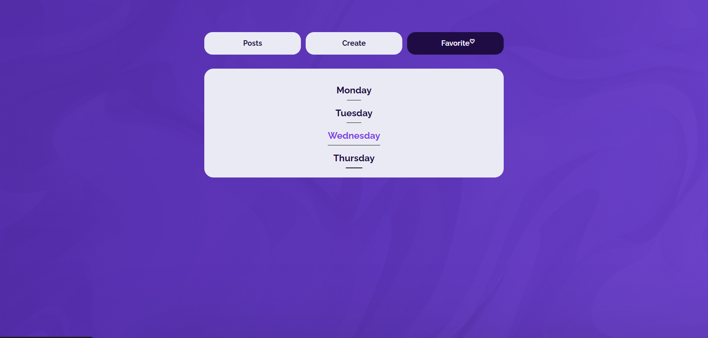
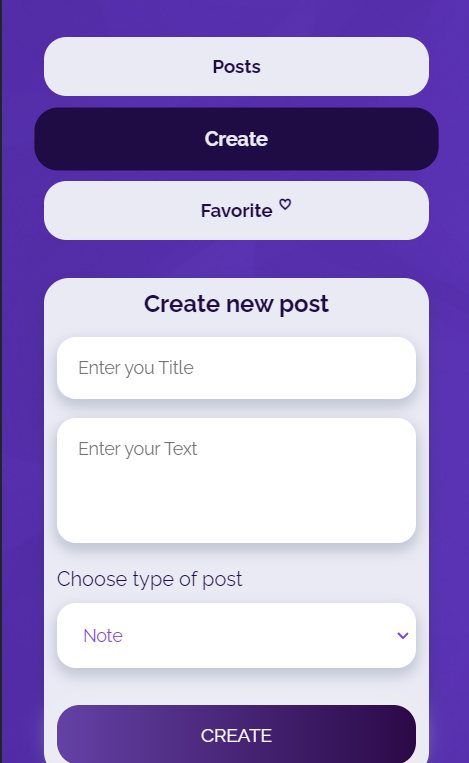

# [TODO](https://mkaell.github.io/Todo/dist/)
### _Application functionality:_ 
This application allows you to create posts that are recorded on the Realtime Database of FireBase .  Adding posts to favorites.There is validation of the form.It is possible to delete posts from the Database.
### _Technologies used:_ 
- **BEM** and the **Sass** preprocessor are used.
- **Webpack** was used to build the project.
-  The application works using **localStorage**.
- **FireBase** was used to create the Realtime Database
-  There is an adaptation for all devices.

### Dependencies used:
```
-"@babel/core": "^7.9.0",
-"@babel/plugin-proposal-class-properties": "^7.8.3",
-"@babel/preset-env": "^7.9.5",
-"@babel/preset-typescript": "^7.9.0",
-"babel-eslint": "^10.1.0",
-"babel-loader": "^8.1.0",
-"clean-webpack-plugin": "^3.0.0",
-"copy-webpack-plugin": "^5.1.1",
-"cross-env": "^7.0.2",
-"css-loader": "^3.5.2",
-"csv-loader": "^3.0.2",
-"eslint": "^6.8.0",
-"eslint-loader": "^4.0.0",
-"file-loader": "^6.0.0",
-"html-webpack-plugin": "^4.2.0",
-"less": "^3.11.1",
-"less-loader": "^5.0.0",
-"mini-css-extract-plugin": "^0.9.0",
-"node-sass": "^4.13.1",
-"optimize-css-assets-webpack-plugin": "^5.0.3",
-"papaparse": "^5.2.0",
-"sass-loader": "^8.0.2",
-"style-loader": "^1.1.3",
-"terser-webpack-plugin": "^2.3.5",
-"webpack": "^4.42.1",
-"webpack-bundle-analyzer": "^3.7.0",
-"webpack-cli": "^3.3.11",
-"webpack-dev-server": "^3.10.3",
-"xml-loader": "^1.2.1"
```

## Commands

* ```npm run dev``` - collecting development.
* ```npm run build``` - collecting production.
* ```npm start``` - tracking files and opening them in the browser.
* ```npm run stats``` - we look at the sizes and stats of the bundle.

## Installation

Install all the necessary packages from package.json

```bash
npm install
```

Launching

```bash
npm start
```

<div align="center">
  
  
  
</div>



